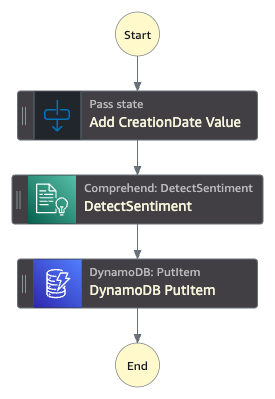
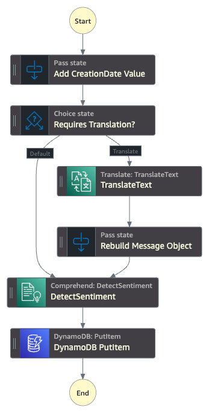

# Workshop Instructions

This workshop should cost less than $5USD to complete. Ensure unused resources are deleted, or at least the retrieval function schedule trigger be disabled at the end of the workshop.

## Stage 1 - MVP Concept

### Part 1A) Deploy CloudFormation

1. Navigate to the **CloudFormation** console.

2. Click **Create stack**, and select **With new resources (standard)** if prompted.

3. Enter the details below in the **Amazon S3 URL** text field:

   `https://ssennett-lab-persistent.s3.amazonaws.com/2024/realtimesocialmedianalysis/labstack.yaml`

4. Click **Next**.

5. Enter the stack name `RTSocialMedia` (or another, if desired).

6. Click **Next**.

7. Leave the stack options as the default, and click **Next**.

8. Check the box **I acknowledge that AWS CloudFormation might create IAM Resources**.

9. Click **Submit** to start launching the CloudFormation stack, and wait for the status `CREATE_COMPLETE`. This should take just under 2 minutes.

You have now deployed the initial AWS Lambda Function skeletons and necessary IAM permissions to complete the lab.

### Part 1B) Create DynamoDB Table

1. Navigate to the **DynamoDB** console.

2. Click **Create table**.

3. Enter the **Table name**: `social-sentiment-db`

4. Enter the **Partition key**: `CreationDate`, with the data type of `String`.

5. Enter the **Sort key**: `EpochTimestamp`, with the data type of `Number`.

6. Leave the remaining table settings as the defaults.

7. Click **Create table**.

8. Once created, open the table `social-sentiment-db`.

9. Click the **Additional info** expansion panel

10. Copy the **Amazon Resource Name (ARN)** to a notepad document for later use.

    This will look something like `arn:aws:dynamodb:us-east-1:123456789012:table/social-sentiment-db`.

You have now created the DynamoDB table that will store your analysed posts.

### Part 1C) Build Step Function State Machine

1. Navigate to the **Step Functions** console.

2. Under the *State machines* list, click **Create state machine**.

3. Ensure the *Blank* template is selected, and click **Select**.

4. In the left-sidebar, select the **Flow** tab, and drag the **Pass** state into the canvas where it says *Drag first state here*.

5. Enter the *State name* as **Add CreationDate Value**.

6. On the *Input* tab, select the checkbox **Transform input with Parameters - *optional***

7. Enter the following JSON into the textbox:
    ```json
        {
            "id.$": "$.id",
            "creationDate.$": "States.Format('{}-{}-{}', $.dateTime.year, $.dateTime.month, $.dateTime.day)",
            "epochTimestamp.$": "$.dateTime.epochTime",
            "message.$": "$.message",
            "author.$": "$.author",
            "lang.$": "$.lang"
        }
    ```

8. In the left-sidebar, select the **Actions** tab, and select the **Amazon Comprehend** service (half-way down the list)

9. Drag the **DetectSentiment** state into the canvas, directly below **Add CreationDate Value**.

10. In the **API Parameters**, change the following details:
    * Set the `LangCode` to `en`.
    * Modify the `Text` key into `Text.$`
    * Set the value of `Text.$` to `$.message`

11. On the *Output* tab, select the checkbox **Add original input to output using ResultPath - *optional***.

12. Leave the dropdown box on *Combine original input with result*.

13. Enter the JSONPath: `$.SentimentAnalysis` to the textbox.

14. In the left-sidebar, select the **Actions** tab, and use the search bar to search for `PutItem`.

15. Drag the `DynamoDB:PutItem` (blue icon) state into the canvas, directly below **DetectSentiment**.

16. Enter the followign JSON into the **API Parameters**:
    ```json
        {
            "TableName": "social-sentiment-db",
            "Item": {
                "CreationDate": {
                    "S.$": "States.Format('{}',$.creationDate)"
                },
                "EpochTimestamp": {
                    "N.$": "States.Format('{}',$.epochTimestamp)"
                },
                "Message": {
                    "S.$": "$.message"
                },
                "Sentiment": {
                    "S.$": "$.SentimentAnalysis.Sentiment"
                }
            }
        }
    ```

17. Click the **Config** button at the top of the screen to open the state machine configuration.

18. Change the **State machine name** to `analyze_post`

19. Change the **Execution role** to the item named `RTSocialMedia-StepFunctionsIAMRole-*`

    Your role may have a different name, depending on the name of your CloudFormation stack.

20. Click the **Create** button at the top-right of the screen.

21. Copy the **ARN** to a notepad document for later use.

    This will look something like `arn:aws:states:us-east-1:123456789012:stateMachine:analyze_post`

Your state machine has now been created, and is ready to analyse posts.



### Part 1D) Test analyze_post State Machine

1. Click the **Start execution** button for the state machine.

2. Enter the following JSON into the **Input** text box:
    ```json
    {
        "id": "ffffffff-ffff-ffff-ffff-ffffffffffff",
        "dateTime": {
            "epochTime": 1704067200000,
            "year": "2024",
            "month": "01",
            "day": "01",
            "hour": "00",
            "minute": "00",
            "second": "00",
            "millisecond": "000"
        },
        "message": "@BigShinyCorp is the bees knees in pretend megacorporations. Absolutely tippy-top spot-on! 1000/10 would post again",
        "author": "@TestPoster1337",
        "lang": "en"
    }
    ```

3. Click the **Start execution** button.

4. On the execution page, wait for the **Execution status** to be marked as `Successful`.

    🙋 **Not working?** No worries! There'll be an answer - let me know, and we can troubleshoot!

5. Explore the **Graph View** to see the results at each stage. Here's a few interesting bits:

* On the **Add CreationDate Value** state, notice the difference between the *Input* and *Output* format.
* On the **DetectSentiment** state, notice the *Output* includes confidence scores of the result.
* On the **DynamoDB PutItem** state, notice the *Definition* includes four values; the `CreationDate`, `EpochTimestamp`, `Message`, and `Sentiment`.

Your MVP is now working. Let's make sure it's writing to the database correctly.

### Part 1E) Check DynamoDB Table

1. Navigate to the **DynamoDB** console.

2. Open the **social-sentiment-db** table properties.

3. Click **Explore table items**.

4. Confirm that the record from the previous test is now present, including the detected sentiment.

Congratulations, you can now detect sentiment from a social media post! But now we need to automate the real-time ingestion.

## Stage 2 - Real-Time Data Ingestion

### Part 2A) Create Kinesis Data Stream

1. Navigate to the **Kinesis** console.

2. Click **Create data stream**.

3. Enter the **Data stream name**: `social-stream`

4. Ensure the **Capacity mode** `On-demand` is selected.

5. Click **Create data stream**.

6. Copy the **ARN** to a notepad document for later use.

    This will look something like `arn:aws:kinesis:us-east-1:123456789012:stream/social-stream`.

Your Kinesis Data Stream is now ready to accept incoming data.

### Part 2B) Enable retrieval Lambda Function

1. Navigate to the **Lambda** console.

2. Open the function beginning with `RTSocialMedia-RetrievePostsLambdaFunction-*`.

3. Under the **Function overview**, click the existing **EventBridge (CloudWatch Events)** trigger.

4. Click the trigger details name beginning with `RTSocialMedia-RetrievePostsLambdaTrigger-*`.

5. Click the **Enable** button to enable the trigger.

6. After two minutes, navigate back to the **Kinesis** console, and open the **social-stream**.

7. Open the **Data viewer** tab.

8. Select the **Shard**: `shardId-000000000000`.

9. Select the **Starting Position** dropdown, and select **At timestamp**.

10. Enter the **Creation time** for the Data Stream to retrieve all posts the data stream has been sent.

Your Kinesis data stream will now recieve the social media posts every minute when the Lambda Function triggers.

### Part 2C) Trigger State Machine from Kinesis with Lambda

1. Navigate to the **Lambda** console.

2. Open the function beginning with `RTSocialMedia-IngestDataLambdaFunction-*`.

    ℹ️ **Explanation:** This reads the incoming data that Lambda receives from Kinesis, and passes it to a new State Machine execution. Same as the test in Part 1D, but automated.

3. Edit the `stateMachineArn` constant on line 4, and enter the ARN for the State Machine copied at the end of Part 1C.

4. Click **Deploy** to save the new code changes.

5. Click **+ Add trigger**.

6. Select the source **Kinesis** from the dropdown.

7. Configure the following settings:

* **Kinesis stream**: `kinesis/social-stream`
* **Consumer - *optional***: *-Leave Blank-*
* **Activate trigger**: *Checked*
* **Batch size**: `100`
* **Starting position**: `Latest`
* **Batch window - *optional***: `10`

8. Click **Save**.

Your Lambda Function will now trigger a new batch of State Machine executions for every batch of posts recieved by the Kinesis Data Stream.

### Part 2D) Check State Machine Executions & DynamoDB Tables

1. Navigate to the **Step Functions** console.

2. Open the **analyze_posts** state machine.

3. Check the list of **Executions**, which should now have 20 being executed successfully every minute.

    🙋 **Seeing Failed Executions?** No worries! There'll be an answer - let me know, and we can troubleshoot!

4. Navigate to the **DynamoDB** console.

5. Open the **social-sentiment-db** table.

6. Click **Explore table items**.

7. Check the **Items returned**, which should include many more posts than the first initial test post.

Congratulations, you now have a pipeline that is recieving and analysing dozens of posts per minute to assess their sentiment! But there's more we can do to get even better information...

## Stage 3 - Language Translation & Generative AI Reporting

### Part 3A) Setup Amazon Bedrock Access (if required)

1. Navigate to the **Bedrock** console.

2. In the left-sidebar, click **Model access**.

3. Click **Modify model access**.

4. Find and check the box for **Claude 3 Sonnet**.

5. Click **Next**.

6. Complete the necessary details. When prompted for a use case, the following can be provided:

    > Participating in a hands-on workshop developing a real-time sentiment analysis solution using Generative AI for summarisation.

7. Submit the model access request.

### Part 3B) Implement Language Translation Functionality

1. Navigate to the **Step Functions** console.

2. Open the **analyze_posts** state machine.

3. Click **Edit** to update the state machine definition.

4. In the left-sidebar, select the **Flow** tab, and drag the **Choice** state into the canvas, between **Add CreationDate Value** and **DetectSentiment**.

5. Enter the *State name* as **Requires Translation?**.

6. Edit the settings for **Rule #1**, and click **Add conditions**.

7. Enter the following settings:

* **Not**: `NOT`
* **Variable**: `$.lang`
* **Operator**: `is equal to`
* **Value**: *String constant* of `en`

8. Click **Save conditions**

9. Enter the **Comment - *optional***: Translate

10. In the left-sidebar, select **Actions**, and use the search bar to search for `TranslateText`.

11. Drag the **TranslateText** state into the canvas onto the *Drop state here* placeholder, directly below the choice description **Translate**.

12. Copy the following JSON into the **API Parameters** textbox:
    ```json
    {
        "SourceLanguageCode.$": "$.lang",
        "TargetLanguageCode": "en",
        "Text.$": "$.message"
    }
    ```

13. On the *Output* tab, select the checkbox **Add original input to output using ResultPath - *optional***.

14. Leave the dropdown box on *Combine original input with result*.

15. Enter the JSONPath: `$.Translation` to the textbox.

16. In the left-sidebar, select the **Flow** tab, and drag the **Pass** state into the canvas directly below **TranslateText**.

17. Enter the *State name* as **Rebuild Message Object**.

18. Change the **Next state** to `DetectSentiment`

19. On the *Input* tab, select the checkbox **Transform input with Parameters - *optional***

20. Enter the following JSON into the textbox:
    ```json
        {
            "id.$": "$.id",
            "epochTimestamp.$": "$.epochTimestamp",
            "creationDate.$": "$.creationDate",
            "message.$": "$.Translation.TranslatedText",
            "author.$": "$.author",
            "lang.$": "$.lang"
        }
    ```

21. Click **Save**.

Your state machine will now process any social media posts into English before analysing the sentiment, and storing them in DynamoDB.



### Part 3C) Setup Amazon SNS Topic

1. Navigate to the **Simple Notification Service (SNS)** console.

2. In the left-sidebar, click **Topics**.

3. Click **Create topic**.

4. Select the **Type**: `Standard`.

5. Enter the **Name**: `sentiment-reports`.

6. Click **Create topic**.

7. On the topic details page, copy the **ARN** to a notepad document for later use.

    This will look something like `arn:aws:sns:us-east-1:123456789012:sentiment-reports`.

8. Click **Create subscription**.

9. Select the **Protocol**: `Email`.

10. Enter the **Endpoint**: `<your chosen email address>`.

11. Click **Create subscription**.

12. Navigate to your email, and find the new `AWS Notification - Subscription Confirmation`.

13. Confirm the topic, and click the **Confirm subscription** link.

14. Return to the AWS Console, and navigate back to the `sentiment-reports` topic.

15. Click **Publish message**.

16. Enter the following details:

* **Subject**: `Test Message`
* **Message Body**: `This is a test message for my SNS topic`

17. Click **Publish message**.

18. Ensure that the message is received.

You can now send notifications to your email account.

### Part 3D) Build the RunReport Lambda Function

1. Navigate to the **Lambda** console.

2. Open the function beginning with `RTSocialMedia-RunReportLambdaFunction-*`.

    ℹ️ **Explanation:** This reads the incoming data that Lambda receives from Kinesis, and passes it to a new State Machine execution. Same as the test in Part 1D, but automated.

3. Edit the `stateMachineArn` constant on line 4, and enter the ARN for the State Machine copied at the end of Part 1C.

4. Click **Deploy** to save the new code changes.

5. Click **Test**.

6. Click **Invoke** to trigger the Lambda function.

Congratulations, the report should now be delivered to your inbox, and your solution for this workshop is completed!

## Stage 4 - Cleanup Checklist

1. Delete CloudFormation stack

2. Delete Kinesis Data Stream

3. Delete Step Functions State Machine

4. Delete DynamoDB Table
